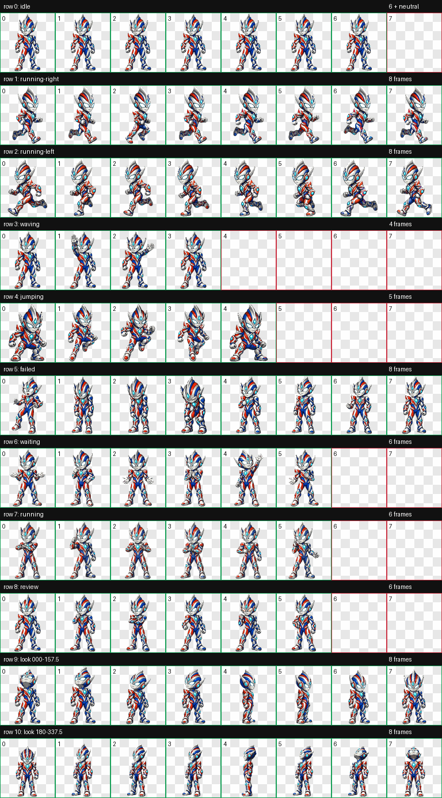

# Light Guardian Pet / 光之守护者

[中文说明](README.zh-CN.md)

An original tokusatsu-inspired desktop companion for Windows, packaged with a Codex-compatible v2 pet atlas.



## Features

- Automatically switches between red and blue forms every 3 minutes.
- Click the pet to display `给你光的力量` (“The power of light is yours”) and play a wave animation.
- After 5 minutes without interaction, the pet patrols left and right along the bottom of the primary screen.
- Right-click to resize to 50%, 75%, 100%, 125%, 150%, or 200%.
- Drag to reposition; use the context menu to switch forms, reset position, or exit.
- Includes an 8 × 11, sprite version 2 atlas with 16 look directions for Codex.

## Quick start

Requirements: Windows 10/11 with Windows PowerShell 5.1 or later.

1. Download and extract the latest Release ZIP.
2. Double-click `launch.cmd` or `启动光之守护者.cmd`.
3. If Windows shows a security warning, review the included PowerShell source before running it.

Optional command-line parameters:

```powershell
powershell.exe -NoProfile -ExecutionPolicy Bypass -STA -File .\LightGuardianPet.ps1 -StartForm blue -Scale 1.25 -IdleSeconds 300
```

## Install the Codex pet

Copy the `codex-pet` directory to:

```text
%USERPROFILE%\.codex\pets\light-guardian
```

Then restart Codex and select **光之守护者** from the pet list. The standalone Windows launcher supplies the timer, click message, resize menu, and idle-flight behavior.

## Repository layout

```text
assets/          Red, blue, and base PNG atlases
codex-pet/       Codex v2 pet manifest and WebP atlas
docs/            Preview and 16-direction QA images
LightGuardianPet.ps1
launch.cmd
```

## Licensing and disclaimer

- Source code is licensed under the [MIT License](LICENSE).
- Character art and sprite assets are available for personal, non-commercial use only; see [ASSET-LICENSE.md](ASSET-LICENSE.md).
- This is an original fan-made tokusatsu homage. It is not affiliated with or endorsed by Tsuburaya Productions or any other rights holder. No original franchise logos or extracted game/animation assets are included.

## Credits

Designed and assembled with AI-assisted image generation and deterministic sprite-atlas validation.

